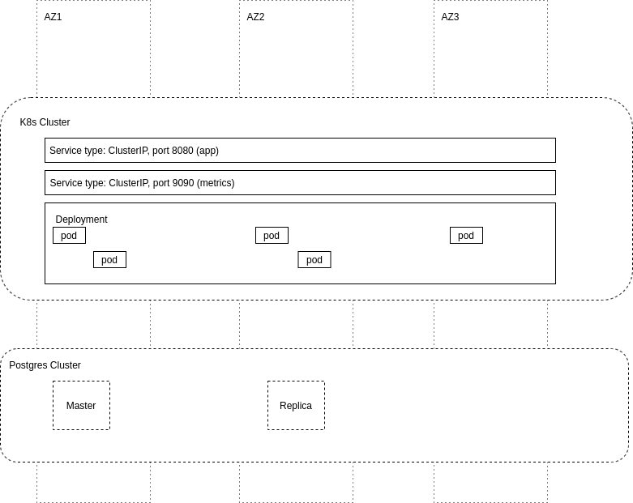

# my-awesome-birthday-app
^_^

## external requirements
- provisioned K8s cluster (v1.22.2)
- provisioned Postgress instances and database
- Postgress user with perrmisions: "CREATE TABLE, INSERT, UPDATE"
- Helm
- go 1.17
- Docker

## application configuration options
Application can be configured by setting following environment variables:
```
	DbHost        string `envconfig:"DB_HOST" required:"true"`
	DbUser        string `envconfig:"DB_USER" required:"true"`
	DbPass        string `envconfig:"DB_PASS" required:"true"`
	DbPort        string `envconfig:"DB_PORT" required:"true"`
	DbName        string `envconfig:"DB_NAME" required:"true"`
	HttpPort      string `envconfig:"HTTP_PORT" default:"8080"`
	MetricsPort   string `envconfig:"METRICS_PORT" default:"9090"`
	MigrationsDir string `envconfig:"MIGRATIONS_DIR" default:"/migrations"`
	ShutdownWait  int    `envconfig:"HTTP_SHUTDOWN_WAIT" default:"1"`
	Debug         bool   `envconfig:"DEBUG" default:"false"`
```

## testing

Tests can be run by executing `./test.sh` from the repo root direcotry.

## building

To build application container run: 
`DOCKER_REGISTRY="docker.io/gites" ./build.sh`
Replace `DOCKER_REGISTRY` with your registry url and user.

Only `linux/amd64` binary will be build. This can be changed by editing `build.sh`

## deploy

Steps to deploy the app:
- create K8s secret for database: `kubectl create secret generic bapp-secret --from-literal=pass=<password>`
- get version tag by running `git rev-parse --short HEAD`
- edit `helm-chart/values.yaml` and set `DB_HOST`, `DB_USER`, `DB_PORT`, `DB_NAME` to proper values
- if your K8s cluster supports Prometheus Operator set `enableServiceMonitor` to `true`
- run helm: `helm template helm-chart helm-chart | kubectl apply -f - `

## accessing the app
To proxy application to `localhost` port `8080` run:
`kubectl port-forward svc/my-awesome-birthday-app 8080`


## deployment diagram

All elements with dashed lines on this diagram are consider to be an external requirements and should be created before deploying the app. 
Attached helm chart only deploy the components that are drawed using full lines.


## comment about database migrations

In real life production application, database migrations should be executed before deployment of new app version.
In this excersise I took a liberty to run them when the app is starting, to make my life a little bit easier ;)


